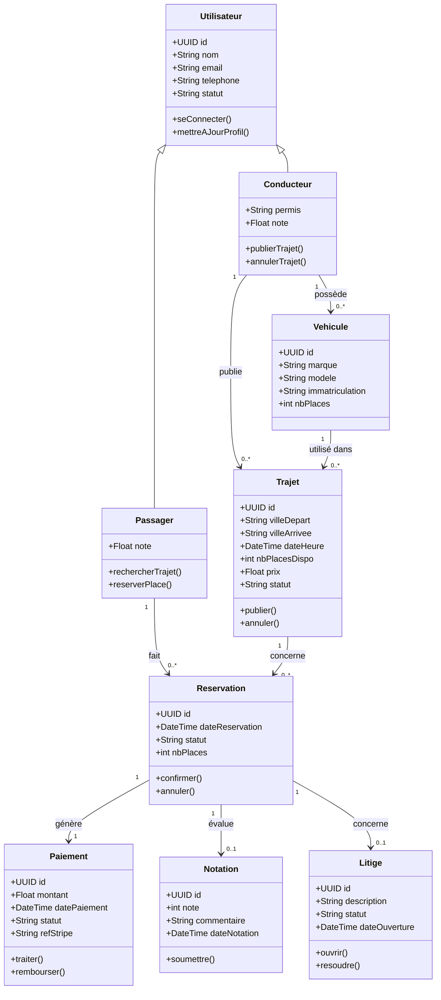

# Diagramme de classes — ProxiVroum

```mermaid
classDiagram
  class Utilisateur {
    +UUID id
    +String nom
    +String email
    +String telephone
    +String statut
    +seConnecter()
    +mettreAJourProfil()
  }
  class Conducteur {
    +String permis
    +Float note
    +publierTrajet()
    +annulerTrajet()
  }
  class Passager {
    +Float note
    +rechercherTrajet()
    +reserverPlace()
  }
  class Vehicule {
    +UUID id
    +String marque
    +String modele
    +String immatriculation
    +int nbPlaces
  }
  class Trajet {
    +UUID id
    +String villeDepart
    +String villeArrivee
    +DateTime dateHeure
    +int nbPlacesDispo
    +Float prix
    +String statut
    +publier()
    +annuler()
  }
  class Reservation {
    +UUID id
    +DateTime dateReservation
    +String statut
    +int nbPlaces
    +confirmer()
    +annuler()
  }
  class Paiement {
    +UUID id
    +Float montant
    +DateTime datePaiement
    +String statut
    +String refStripe
    +traiter()
    +rembourser()
  }
  class Notation {
    +UUID id
    +int note
    +String commentaire
    +DateTime dateNotation
    +soumettre()
  }
  class Litige {
    +UUID id
    +String description
    +String statut
    +DateTime dateOuverture
    +ouvrir()
    +resoudre()
  }

  Utilisateur <|-- Conducteur
  Utilisateur <|-- Passager
  Conducteur "1" --> "0..*" Vehicule : possède
  Conducteur "1" --> "0..*" Trajet : publie
  Passager "1" --> "0..*" Reservation : fait
  Vehicule "1" --> "0..*" Trajet : utilisé dans
  Trajet "1" --> "0..*" Reservation : concerne
  Reservation "1" --> "1" Paiement : génère
  Reservation "1" --> "0..1" Notation : évalue
  Reservation "1" --> "0..1" Litige : concerne
```
