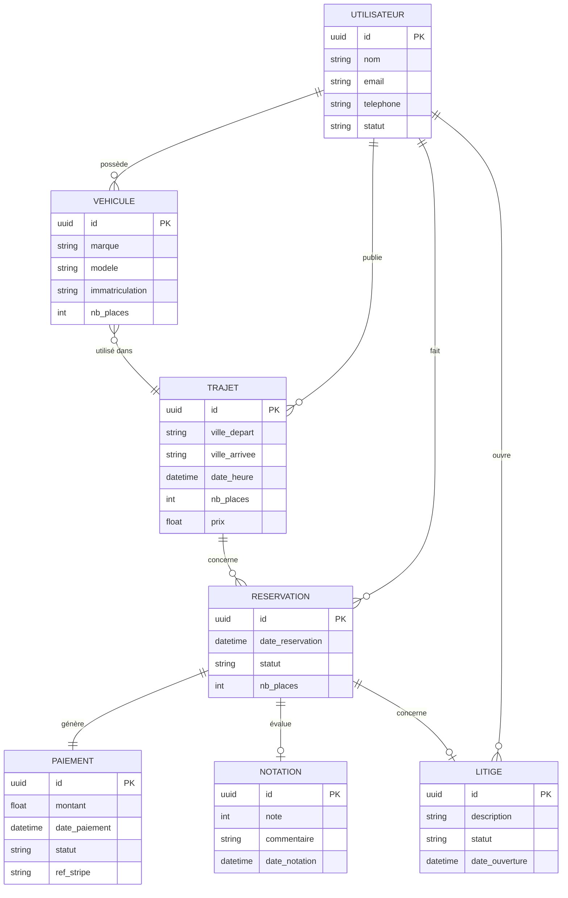

# MCD — ProxiVroum

## Entités et relations

## Vérification 3NF
- **1FN** : toutes les valeurs sont atomiques
- **2FN** : chaque attribut dépend de toute la clé primaire
- **3FN** : aucune dépendance transitive entre attributs non-clés
