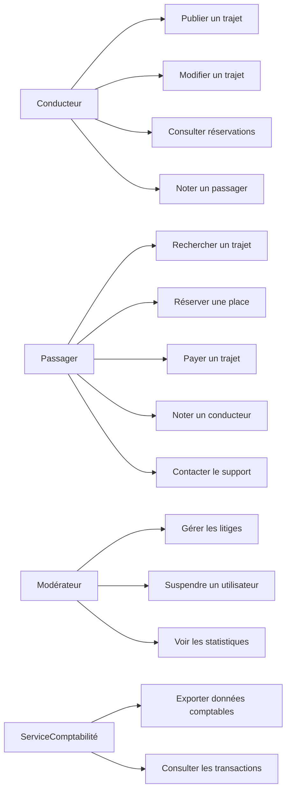

# Diagramme de cas d'utilisation — ProxiVroum

```mermaid
flowchart LR
  Conducteur --> UC1[Publier un trajet]
  Conducteur --> UC2[Modifier un trajet]
  Conducteur --> UC3[Consulter réservations]
  Conducteur --> UC4[Noter un passager]

  Passager --> UC5[Rechercher un trajet]
  Passager --> UC6[Réserver une place]
  Passager --> UC7[Payer un trajet]
  Passager --> UC8[Noter un conducteur]
  Passager --> UC9[Contacter le support]

  Modérateur --> UC10[Gérer les litiges]
  Modérateur --> UC11[Suspendre un utilisateur]
  Modérateur --> UC12[Voir les statistiques]

  ServiceComptabilité --> UC13[Exporter données comptables]
  ServiceComptabilité --> UC14[Consulter les transactions]
```
